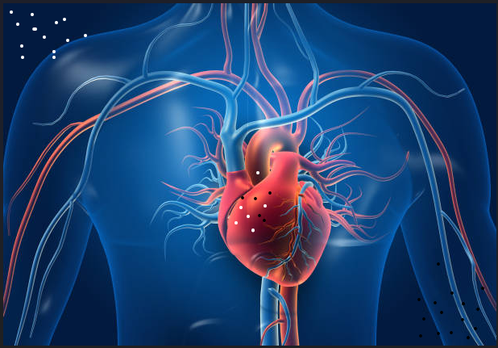
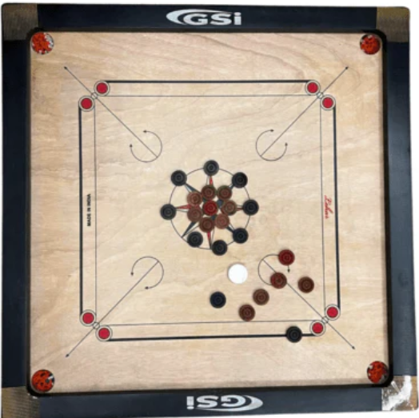

# Image Classification Project - A2_29_CV(TA2)

This repository contains an image classification task that involves distinguishing between various categories of images such as:

- **Chess Game Board**
- **Human Heart Illustration**
- **Carrom Board**

The classification is implemented using Python and computer vision techniques inside a Jupyter notebook.

## 📁 Files Included

- `A2_29_CV(TA2).ipynb` — The main Jupyter Notebook containing the image classification model and code.
- `chess.jpg` — Sample image of a chess board.
- `heartnew.png` — Illustration of the human heart used for classification.
- `carrom.png` — Image of a carrom board used in the dataset.

## 🧠 Objective

The aim of this project is to perform **image classification** using basic computer vision techniques or pre-trained models to identify and categorize the above images correctly.

## 🛠️ Technologies Used

- Python
- Jupyter Notebook
- OpenCV
- NumPy
- Matplotlib
- TensorFlow / PyTorch (if applicable)

## 🔧 How to Run

1. Clone the repository:
   ```bash
   git clone https://github.com/anshul-santosh-sahu/image-classification-a2-29.git
   cd image-classification-a2-29
   ```

2. Open the Jupyter notebook:
   ```bash
   jupyter notebook A2_29_CV(TA2).ipynb
   ```

3. Run all the cells in the notebook to see the image classification pipeline in action.

## 📷 Preview

Below are the sample images used:

| Chess | Heart | Carrom |
|-------|-------|--------|
|  |  |  |

## 👤 Author

- **Anshul Sahu**  
  Course: Computer Vision Assignment - Task 2

## 📜 License

This project is for educational purposes only.
```

---

Let me know if you'd like me to generate the `README.md` file for download directly.
